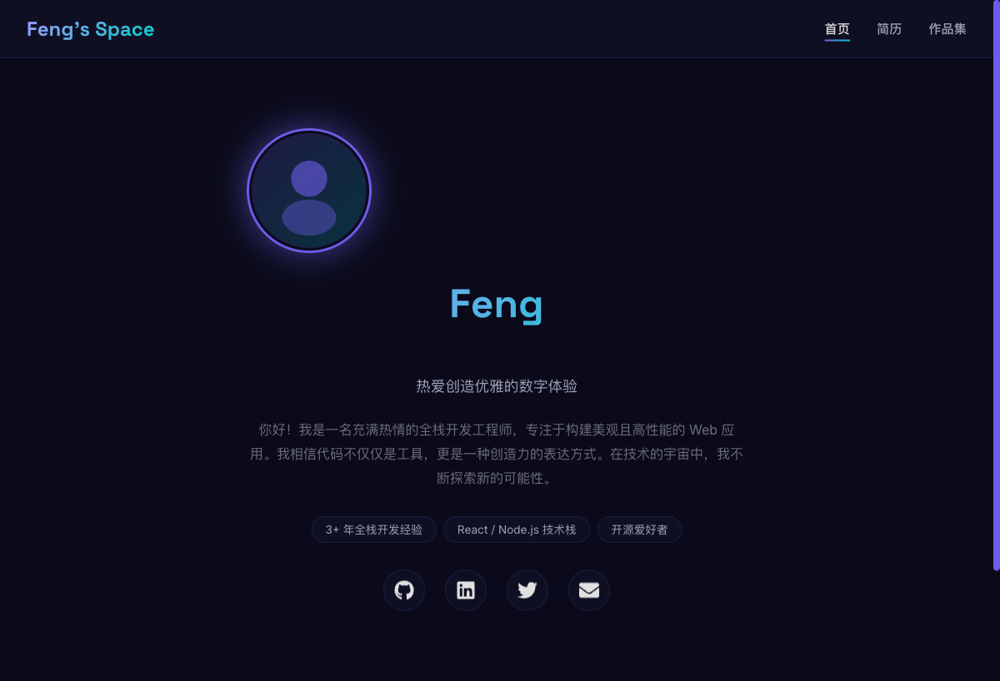

# 创意个人博客 / 简历网站 (Creative Personal Blog & Resume)

本项目是一个使用现代化前后端技术栈构建的、具有深色宇宙风格和霓虹光效的动态个人网站。它不仅是一个展示个人技能和项目的平台，也是一个探索创意Web动画和效果的实验场。



---

## ✨ 功能特性

- **动态粒子背景**: 基于 `tsparticles` 实现的互动式宇宙星空背景。
- **流畅的页面过渡**: 使用 `Framer Motion` 实现页面间的平滑切换动画。
- **打字机效果**: 首页英雄区域的标题具有动态打字机动画。
- **滚动触发动画**: 页面内容随着用户滚动而优雅地淡入和浮现。
- **响应式设计**: 完美适配桌面、平板和移动设备。
- **减弱动态效果**: 尊重用户的系统偏好，为选择“减少动画”的用户提供降级体验。
- **组件化架构**: 高度模块化的React组件，易于维护和扩展。
- **前后端分离**: 使用Node.js/Express提供数据API，前端通过代理进行请求。

## 🛠️ 技术栈

### 前端 (Frontend)
- **框架**: [React](https://reactjs.org/)
- **构建工具**: [Vite](https://vitejs.dev/)
- **动画**: [Framer Motion](https://www.framer.com/motion/)
- **粒子效果**: [tsParticles](https://particles.js.org/)
- **路由**: [React Router](https://reactrouter.com/)
- **HTTP客户端**: [Axios](https://axios-http.com/)
- **代码规范**: [ESLint](https://eslint.org/)
- **图标**: [React Icons](https://react-icons.github.io/react-icons/)

### 后端 (Backend)
- **环境**: [Node.js](https://nodejs.org/)
- **框架**: [Express](https://expressjs.com/)
- **中间件**: [CORS](https://www.npmjs.com/package/cors), Nodemon (开发)

---

## 🚀 如何开始

请确保您已安装 [Node.js](https://nodejs.org/) (推荐LTS版本)。

### 1. 克隆项目
```bash
git clone https://your-repository-url.com/
cd react-user-profile-360
```

### 2. 启动后端服务
在您的命令行中执行：

```bash
# 进入后端目录
cd backend

# 安装依赖 (只需首次运行)
npm install

# 启动开发服务器 (使用 nodemon 自动重启)
npm run dev
```
后端服务将启动在 `http://localhost:3001`。

### 3. 启动前端应用
打开一个新的命令行窗口，执行：

```bash
# 进入前端目录
cd frontend

# 安装依赖 (只需首次运行)
npm install

# 启动开发服务器
npm run dev
```
前端开发服务器将启动在 `http://localhost:5173` (或其他Vite指定的可用端口)。在浏览器中打开该地址即可查看。
